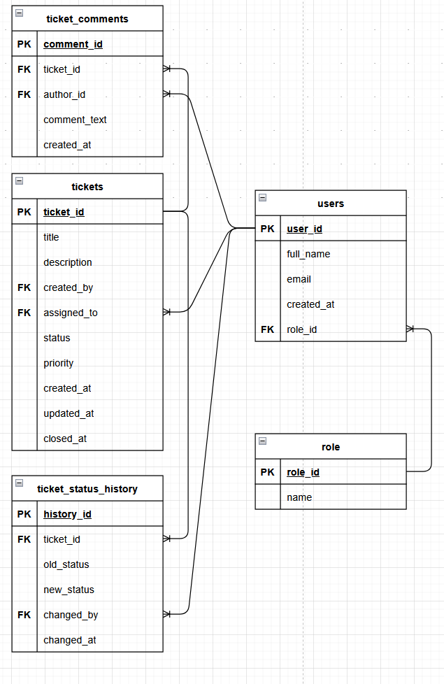
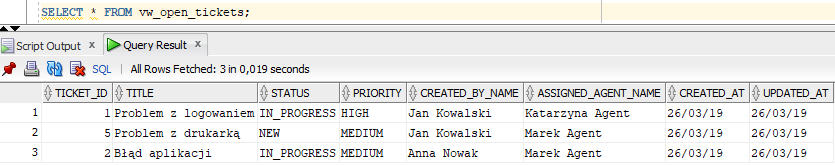
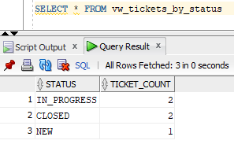

# Oracle PL/SQL Helpdesk System

## Opis projektu

Projekt przedstawia system obsługi zgłoszeń helpdesk oparty o bazę danych Oracle oraz logikę biznesową zaimplementowaną w PL/SQL.
System został zaprojektowany w podejściu **database-centric**, gdzie kluczowa logika aplikacyjna realizowana jest po stronie bazy danych.

---

## Cel projektu

Celem projektu było:

* zaprojektowanie relacyjnego modelu danych,
* implementacja logiki biznesowej w PL/SQL,
* zapewnienie spójności danych poprzez walidacje i ograniczenia,
* przygotowanie podstawowych mechanizmów raportowania.

---

## Zakres projektu

System umożliwia:

* zarządzanie użytkownikami i rolami,
* tworzenie zgłoszeń helpdesk,
* przypisywanie zgłoszeń do agentów,
* zmianę statusów zgłoszeń zgodnie z workflow,
* zamykanie zgłoszeń,
* dodawanie komentarzy,
* zapisywanie historii zmian statusów,
* generowanie widoków raportowych.

---

## Technologie

Projekt został zrealizowany z wykorzystaniem:

* Oracle Database XE
* Oracle PL/SQL
* SQL
* Oracle SQL Developer
* Git
* GitHub
* Markdown

---

## Role użytkowników

W systemie występują następujące role:

* `USER` – użytkownik zgłaszający problem,
* `AGENT` – osoba obsługująca zgłoszenia,
* `ADMIN` – administrator systemu.

---

## Statusy zgłoszeń

System obsługuje następujące statusy:

* `NEW`
* `IN_PROGRESS`
* `RESOLVED`
* `CLOSED`

---

## Priorytety zgłoszeń

System obsługuje następujące priorytety:

* `LOW`
* `MEDIUM`
* `HIGH`

---

## Reguły biznesowe

1. Każdy użytkownik może utworzyć zgłoszenie.
2. Nowe zgłoszenie otrzymuje status `NEW`.
3. Zgłoszenie może zostać przypisane tylko do użytkownika z rolą `AGENT`.
4. Tylko przypisany agent lub administrator może zmienić status zgłoszenia.
5. Status zgłoszenia zmienia się zgodnie z ustalonym workflow.
6. Zgłoszenie może zostać zamknięte tylko po osiągnięciu statusu `RESOLVED`.
7. Każda zmiana statusu jest zapisywana w historii.
8. Do zgłoszenia można dodawać komentarze.
9. Zgłoszenie musi posiadać tytuł i opis.
10. Każdy użytkownik posiada dokładnie jedną rolę.

---

## Przepływ statusów

Dozwolone przejścia:

* `NEW` → `IN_PROGRESS`
* `IN_PROGRESS` → `RESOLVED`
* `RESOLVED` → `CLOSED`
* `RESOLVED` → `IN_PROGRESS`

---

## Model danych

Projekt wykorzystuje relacyjny model danych oparty o tabele:

* `roles`
* `users`
* `tickets`
* `ticket_comments`
* `ticket_status_history`

### Relacje

* użytkownik posiada jedną rolę,
* zgłoszenie jest tworzone przez użytkownika,
* zgłoszenie może być przypisane do agenta,
* zgłoszenie może mieć wiele komentarzy,
* każda zmiana statusu jest zapisywana w historii.

### Kluczowe informacje

Tabela `tickets` zawiera m.in.:

* tytuł i opis zgłoszenia,
* autora zgłoszenia,
* przypisanego agenta,
* status i priorytet,
* daty utworzenia, aktualizacji i zamknięcia.

Tabela `ticket_status_history` przechowuje:

* poprzedni i nowy status,
* użytkownika wykonującego zmianę,
* datę zmiany.

---

## Dane testowe

Projekt zawiera przykładowe dane (`seed.sql`), które umożliwiają szybkie przetestowanie systemu.

Dane obejmują:

* role użytkowników,
* użytkowników,
* zgłoszenia,
* komentarze,
* historię zmian.

---

## Logika biznesowa w PL/SQL

Główna logika systemu została zaimplementowana w pakiecie:

`ticket_management_pkg`

Pakiet zawiera:

* `create_ticket` – tworzenie zgłoszeń
* `assign_ticket` – przypisywanie zgłoszeń do agentów
* `change_status` – zmiana statusów zgodnie z workflow
* `close_ticket` – zamykanie zgłoszeń
* `add_comment` – dodawanie komentarzy
* `get_open_tickets_count` – liczba otwartych zgłoszeń

Walidacje biznesowe realizowane są przy użyciu `RAISE_APPLICATION_ERROR`.

---

## Widoki raportowe

Projekt zawiera widoki wspierające analizę danych:

* `vw_open_tickets` – lista otwartych zgłoszeń
* `vw_tickets_by_status` – liczba zgłoszeń według statusu
* `vw_tickets_by_agent` – liczba zgłoszeń przypisanych do agentów
* `vw_ticket_comments_count` – liczba komentarzy dla zgłoszeń

---

## Przykładowe wyniki

### Otwarte zgłoszenia

### Liczba zgłoszeń według statusu

---
## Jak uruchomić projekt

1. Uruchom `schema.sql`
2. Uruchom `seed.sql`
3. Uruchom `package_spec.sql`
4. Uruchom `package_body.sql`
5. Uruchom `views.sql`
6. (opcjonalnie) uruchom `test_queries.sql`

---

## Testy

Projekt zawiera:

* `sql/test_queries.sql` – zapytania testowe
* `tests/manual_tests.md` – scenariusze testowe

Testy obejmują:

* tworzenie zgłoszeń,
* walidację błędnych danych,
* przypisywanie zgłoszeń,
* zmianę statusów,
* zamykanie zgłoszeń,
* dodawanie komentarzy.

---

## Możliwości rozwoju

Projekt może zostać rozszerzony o:

* bardziej zaawansowane zarządzanie uprawnieniami,
* dodatkowe raporty i analizy,
* automatyczne testy PL/SQL,
* integrację z backendem (API),
* interfejs użytkownika.
